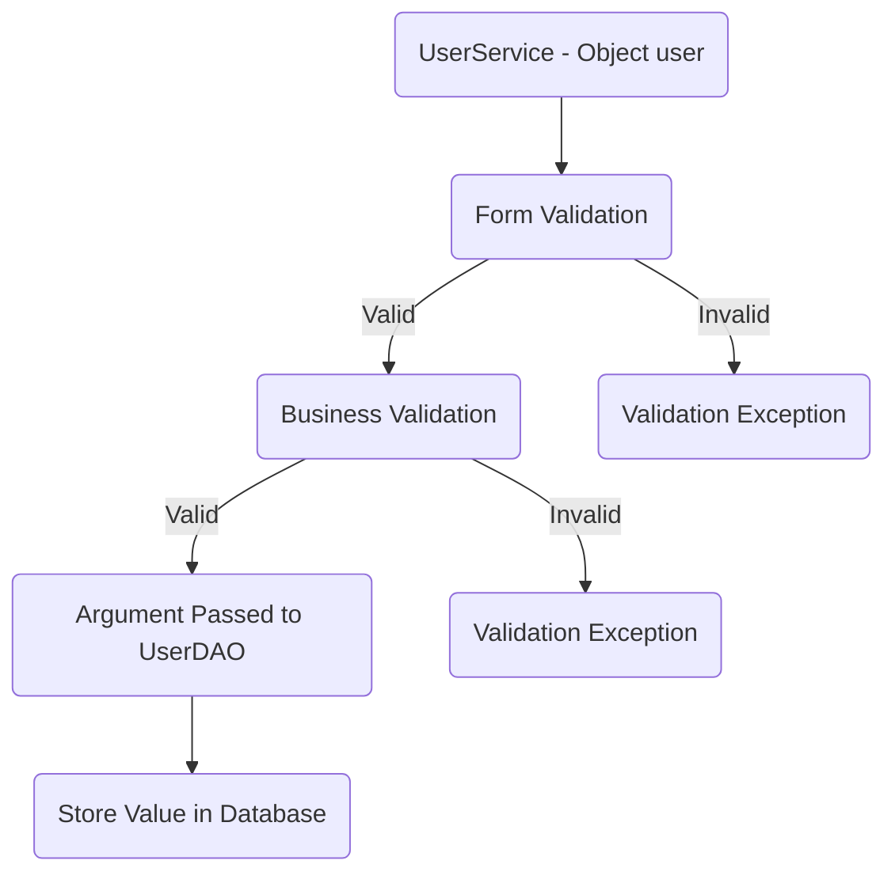
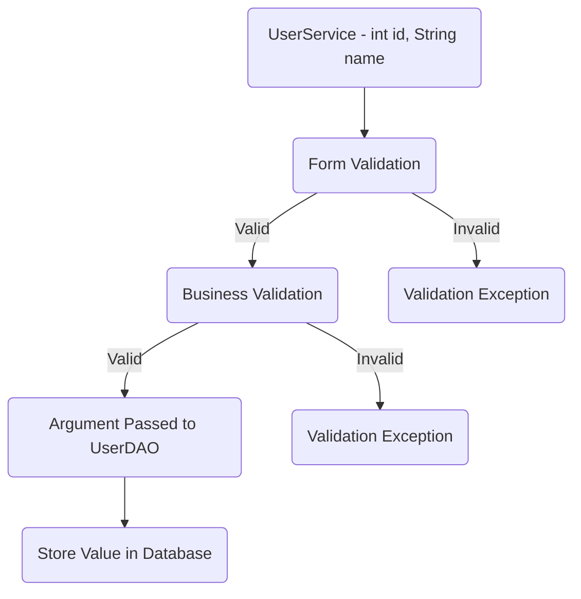
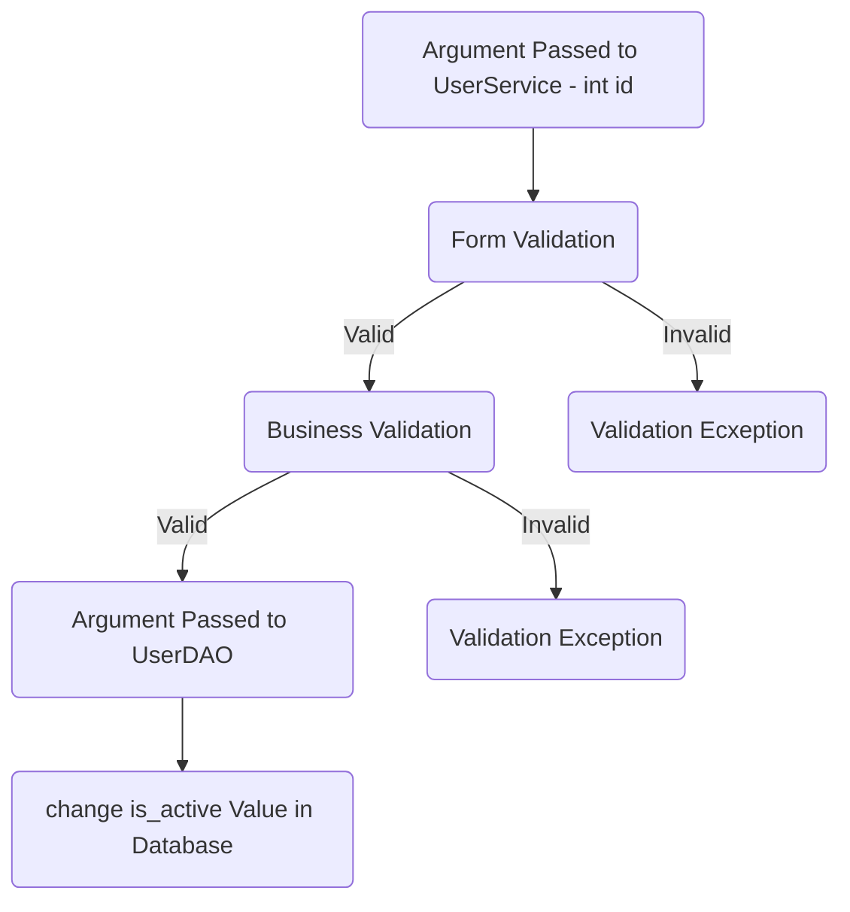
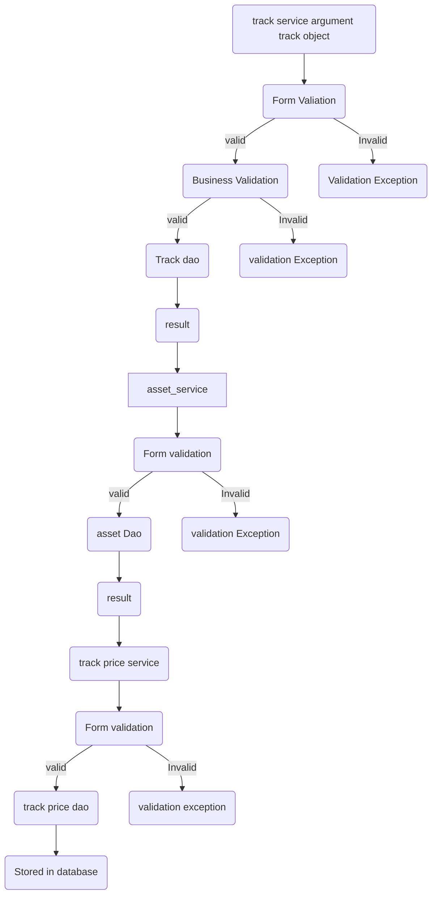
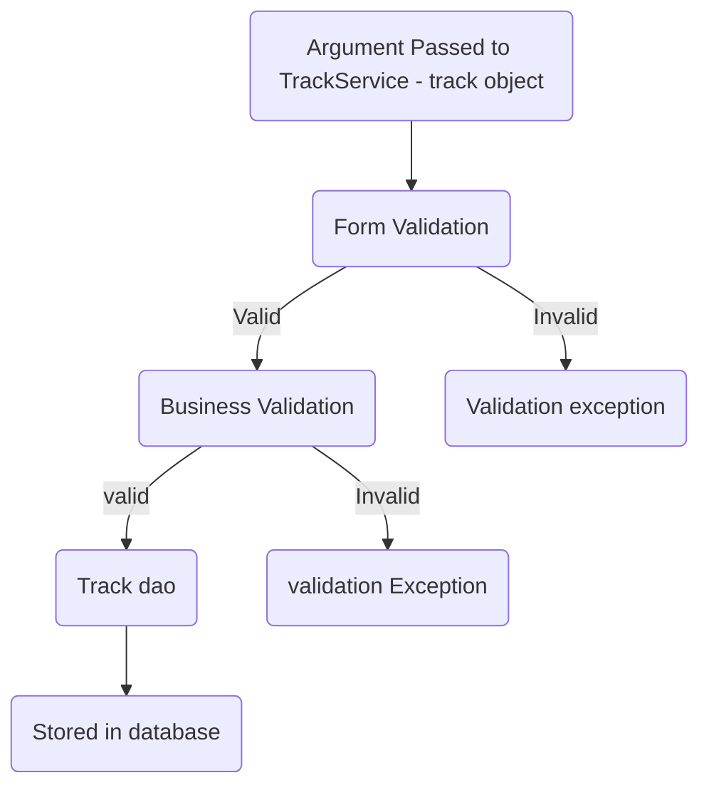
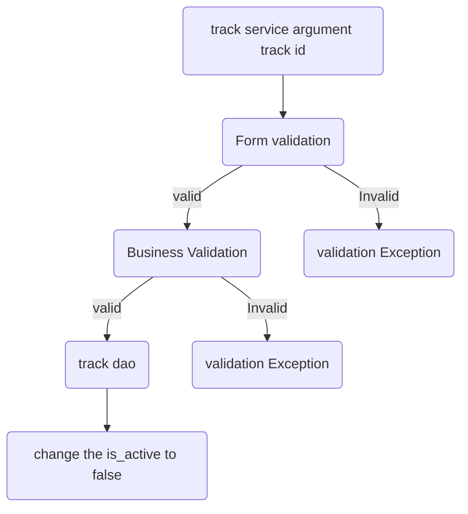
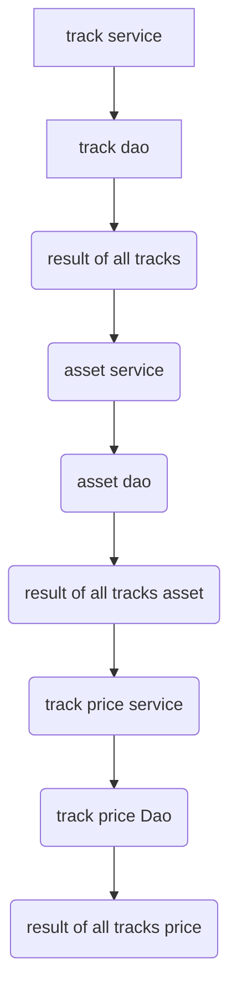
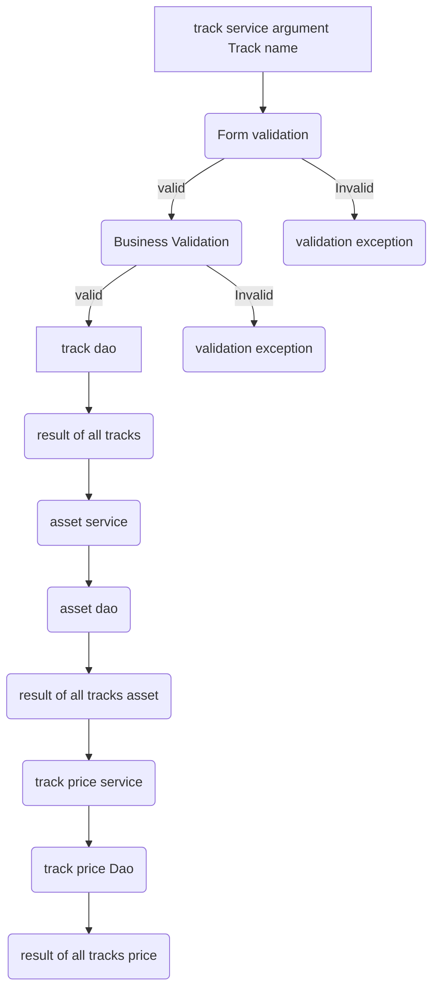

# DOBOO Application Checklist

## Database Design

- [x] Create an ER diagram of the database- [ ![\] ](https://iili.io/HZmKMNI.png)Write Create table scripts [script](path/to/sql/file)

## Project Setup

- [ ] Create a new Java project
- [ ] Set up a MySQL database
- [ ] Add necessary libraries
	- [ ] JDBC, 
	- [ ] MySQL Connector, 
	- [ ] JUnit, 
	- [ ] Dotenv

## Module: User  

### Feature 1 : create User
user Story 
	
		 user details will successfully store in database 
### Pre - requisites : -

- [ ] user table
- [ ] user model
- [ ] user Dao(create) 
- [ ] user service (create)

#### Validations:

- [ ] Form validator 
	 * user object (null)
	 * user email (null, empty, pattern)
	 * user name (null, empty, pattern)
	 * user password(null, empty, pattern)
	 * user date of birth( null, empty,age greater than 16)

- [ ] Business Validation  
	* Email Already exists

#### Messages :  

* User object cannot be null  
* Invalid name input  
* Invalid email input  
* Invalid password input  
* age must be 16   
* User already exists
 
#### Flow:  
> Invalid When a user's email is already in use or when the input provided does not meet the criteria, users arise.

### Feature 2 : Update User  
user Story
	
		user details will successfully update and store in database
				
### Pre-requisites:-

- [ ] completed feature 1 - create user

- [ ] user dao (update)

- [ ] user service (update) 

#### Validations:  

​

- [ ] Form validator  

	*  id (less than or equal to 0) 

	* name ( null, empty, pattern)  

	* password (null , empty, pattern)
	
	*  artist_name(null , empty)

- [ ] Business Validation  

	* Check whether the id exist

​

#### Messages :  

* Invalid id  

*  Invalid name input

* Invalid password input  

* User not found  

​

#### Flow:  

> Invalid When a user's  email is not in use or when the input provided does not meet the criteria, users arise.

​

### Feature 3 : Delete User  
user Story
	
		 user details will successfully delete
​

### Pre-requisites:- 

- [ ] Completed feature 1 - create user

- [ ] user dao (delete)

- [ ] user service (delete)

​

#### Validations:  

- [ ]  Form Validation 

	* id (less than or equal to 0)​

- [ ] Business Validation  

	* Check whether the id exist

#### Messages :  

* Invalid id  

* User not found 

​

#### Flow:  

> Invalid When a user's id is not in use or when the input provided does not meet the criteria, users arise.

​

## Module: Track 

### Feature 4 :  uploading Track

user Story
	
		 user will successfully upload track

### Pre-requisites:- 

- [ ] Completed feature 1 - create user
- [ ] track table
- [ ] track model
- [ ] track dao (create)
- [ ] track service(create)
- [ ] track price table
- [ ] track price model
- [ ] track price dao(create)
- [ ] track price service(create)
- [ ] asset table
- [ ] asset model
- [ ] asset dao(create)
- [ ] asset service (create)

#### Validations:

- [ ] Form validator 
	 * track object (null)
	 * track name (null, empty,pattern)
	 * track price(null,empty,0)
	 * asset audio(ext,url)
	 * asset image(ext,url)
#### Messages :  
   * audio/image invalid format type
   * price must be not 0 or not null
   * track name is empty or null 

#### Flow:  

> Invalid When a track details or image / audio format and name is null or when the input provided does not meet the criteria, users arise.
​

### Feature 5 :  update Track details
user Story
	
		 user will successfully edit the tracks details
		 
### Pre-requisites:- 

- [ ] Completed feature 1 - create user
- [ ] completed feature 4 - upload track
- [ ] track model
- [ ] track dao(update)
- [ ] track service(update)

#### Validations:

- [ ] Form validator 
	 * track object (null)
	 * track id (greater than 0)
	 * track name (null, empty, pattern)
- [ ] Business Validation  

	* Check whether the id exist

#### Message:  
   * track name is empty or null 

#### Flow:  

> Invalid When a track details or name is null or when the input provided does not meet the criteria, users arise.

​

### Feature 6 :  delete Track
user Story
	
		 user will successfully delete the tracks
		 
### Pre-requisites:- 

- [ ] Completed feature 1 - create user
- [ ] completed feature 4 - upload track
- [ ] track model
- [ ] track dao (delete)
- [ ] track service(delete)

#### Validations:

- [ ] Form validator 
	 * id (greater than 0)
- [ ] Business Validation  

	* Check whether the id exist

#### Exceptions:  
   * Invalid id 

#### Flow:  

> Invalid When a track details or image / audio format and name is null or when the input provided does not meet the criteria, users arise.

​

### Feature 7: Find All Tracks

user Story
	
		 user will successfully view all tracks

#### Pre-requisites:

- [ ] Completed feature 1 - create user
- [ ] track table
- [ ] track model
- [ ] track dao 
- [ ] track service
- [ ] track price table
- [ ] track price model
- [ ] track price dao
- [ ] track price service
- [ ] asset table
- [ ] asset model
- [ ] asset dao
- [ ] asset service 

#### Validations:

#### Flow:

### Feature 8: Find All Tracks By Artist Name

user Story
	
		 user will successfully view all tracks by using artist name 

#### Pre-requisites:

- [ ] Completed feature 1 - create user
- [ ] track table
- [ ] track model
- [ ] track dao 
- [ ] track service
- [ ] track price table
- [ ] track price model
- [ ] track price dao
- [ ] track price service
- [ ] asset table
- [ ] asset model
- [ ] asset dao
- [ ] asset service 

#### Validations:

- [ ] Form validator 
	 * artist name(null,empty)
- [ ] Business Validation  

	* Check whether the artist exist

#### Flow:

### Feature 9: Find Matching Tracks By Track Name

user Story
	
		 user will successfully view all tracks by using track name 

#### Pre-requisites:

- [ ] Completed feature 1 - create user
- [ ] track table
- [ ] track model
- [ ] track dao 
- [ ] track service
- [ ] track price table
- [ ] track price model
- [ ] track price dao
- [ ] track price service
- [ ] asset table
- [ ] asset model
- [ ] asset dao
- [ ] asset service 

#### Validations:

- [ ] Form validator 
	 * track name(null,empty)
- [ ] Business Validation  

	* Check whether the track exist

#### Flow:

